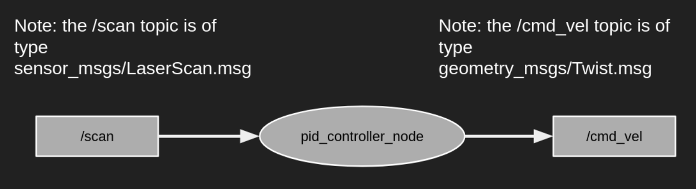
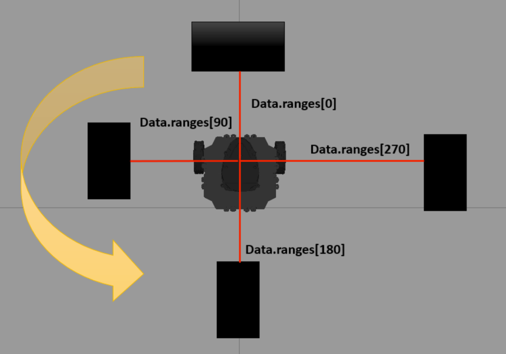

# ME 597- Lab 2

## Kinematics and Control using TurtleBot4

For the second lab, your primary task will be learning how to control the kinematic motion of the TurtleBot4, using the linux terminal and employing the PID algorithm. The PID control algorithm is an imperative tool every roboticist must have handy and is applicable for many scenarios.


#### Words of advice:
* Whenever you're lost or have a doubt, Google it! Self-help will take you a long way in this course. A list of dependable and trustworthy resources (websites) is [here](https://github.com/naslab-projects/ME597-Fall2024/blob/main/0-Setup/Resources/References.md).
* Students who make mistakes AND attempt to correct it will learn way more than those who finish the tasks without any errors/bugs.

# Instructions
This week you will implement a PID controller in simulation. You will use what you've learned from Lab 1 to create a single node that subscribes to lidar data at `/scan`, calculates the PID control output and publishes the velocity command to `/cmd_vel`. The system diagram will look like this:



## Week 4
### Reading (20 min)
First, we need to prepare for the simulator:  
1. Setup TurtleBot4 packages - find the instructions [here](https://github.com/naslab-projects/ME597-Fall2024/blob/main/2-Kinematics_%26_Control/Resources/TurtleBot4_installation_guide.md)
2. Familiarize yourself with the TurtleBot4 Simulator

Next, we will take a look at the physical Turtlebot4, used next week (Week 5): 

3. Take a look at the specs of TurtleBot4 lite: [Turtlebot4Lite](https://turtlebot.github.io/turtlebot4-user-manual/overview/features.html#turtlebot-4-lite)
4. See how the TurtleBot4 will communicate with your PC. We will use the Discovery Server configuration to facilitate multiple robots on the same network and allow use with a Virtual Machine: [Turtlebot4 Networking](https://turtlebot.github.io/turtlebot4-user-manual/setup/networking.html) 
5. Familiarize yourself with the suite of sensors available on the TurtleBot4 from [Turtlebot4 Sensors](https://turtlebot.github.io/turtlebot4-user-manual/software/sensors.html).
 (You won't have to install or run any of these packages, they are pre-installed and are run automatically by the robot upstart service)

PLEASE NOTE:

6. You may only access the physical Turtlebot4s at lab time during your section each week! To prepare for next week, make sure your PID code works in simulation.
7. Although implementation on the physical robot is a grouped task, the simulator PID controller is still an individual assignment and your submitted code should be unique to you. For the physical robot PID controller, a team may use either one of the partners' code.

### Tasks (2 hr) 

`task_3`- PID distance controller using lidar data to allow the TurtleBot4 to stop 'x' meters from an obstacle directly in front of it.
  
#### Part A: Creating the Package and Node
1. Create a ROS 2 `ament_python` package called `task_3`
2. Create a simple Python node within this pkg, called `pid_controller.py`
#### Part B: Subscribe to the `/scan` topic
3. Create a subscriber that reads the `/scan` topic. 
    - Set the rate to 10Hz to define the execution speed of your node. You can tune this parameter - however, setting it too high will cause unnecessary load.
4. Get the forward-facing distance reading from lidar.
    - Check out the `sensor_msgs/LaserScan.msg` [message definition](http://docs.ros.org/en/api/sensor_msgs/html/msg/LaserScan.html). 
    - hint: you will want to use the `float32[] ranges` attribute, which is a list of range values, and for the Turtlebot3 these correspond to:
      
      

#### Part C: Calculate the PID Controller
4. In the callback function, use forward distance measured from the lidar sensor as input to a PID controller to control the velocity.
    - Set the target distance to 0.35 m.
    - Tune your `Kp`, `Ki`, and `Kd` values as you wish.


#### Part D: Publish to the `/cmd_vel` topic
5. In the same node file, create a publisher that writes to the `/cmd_vel` topic to move the robot. [Reference](https://turtlebot.github.io/turtlebot4-user-manual/tutorials/driving.html#command-velocity)
    - The upper bound for `linear.x` must be 0.15 m/s and the lower bound for `linear.x` must be 0 m/s.
    - See the `geometry_msgs/Twist` [message definition](http://docs.ros.org/en/melodic/api/geometry_msgs/html/msg/Twist.html)


#### Part E: Verification
6. Complete the relevant tag details in the `package.xml` file, build and run the ROS 2 node along with gazebo.

    - Launch the world and spawn a turtlebot3 using:
      ```
      ros2 launch turtlebot3_gazebo turtlebot3_house_norviz.launch.py
      ```
    - Don't forget to source your sim_ws first:
      ```
      source ~/path/to/sim_ws/install/local_setup.bash
      ```

7. You may also verify with these commands:
    * $`ros2 node list`
    * $`ros2 topic list`
    * $`ros2 node info <node_name>`
    * $`ros2 topic echo <topic_name>`


### Week 5 

#### Part A: Connect to Robot via ROS2 (Group)

1. With your lab partner, ensure you can communicate with the Turtlebot4 via ROS2 on your PC. Follow the instructions here: [5-Turtlebot4_use.md](https://github.com/naslab-projects/ME597-Fall2024/blob/main/2-Kinematics_&_Control/Resources/5-Turtlebot4_use.md). If you have issues, ask for help.

2. Connect to the Turtlebot4 with your PC via ROS2 (not ssh).

#### Part B: PID Implementation on Physical Robot (Group)

3. Run your PID node on your PC to control the Turtlebot4.
4. Record a video of your PID code running on the robot and submit it on Gradescope.

#### Part C: Inverse Kinematics Derivation (Individual)
5. Inverse Kinematics: This is a written assignment. You may find this assignment on Brightspace. You will submit it on Gradescope.

### Deliverables
Each of the 3 deliverables will have a separate submission:
#### 1. Kinematics Derivation
* Solution to the inverse kinematics derivation problem. May be handwritten or there will be a separate submission for this on Gradescope.

#### 2. Source code
Please Note: All individuals must have unique PID source code for the simulation assignment.

Your ROS 2 package:
  * `task_3`- PID controller to help the TurtleBot4 stop 0.35 m from an obstacle

ros2 bag files
* You will 'record' the data passing through your topics via `ros2 bag`:
  * in any directory outside from your workspace directory, run:
    * $`mkdir bag_files`
    * $`cd bag_files`
    * $`ros2 bag record -o task_3 -a`
  * NOTE: your topic must be alive for ros2 to record it
  * Use this as [reference](https://docs.ros.org/en/galactic/Tutorials/Beginner-CLI-Tools/Recording-And-Playing-Back-Data/Recording-And-Playing-Back-Data.html)

ros2 log files
* Upload `<ws_ros2>/log/` too


#### 3. Video of Physical Robot Implementation
Partners may submit the same video, however, both partners must submit a video. You do not need to make a source code submission for the physical robot implementation. There is no late submission for this assignment.

### Rubric
Deviating from the names provided in the lab sheet will result in penalties.
* 60 pts: Week 5, `task_3` pkg
* 25 pts: Week 5, Inverse Kinematics solution
* 15 pts: Week 5, Video of Successful Physical Robot PID (Group - but both individuals need to submit the video)