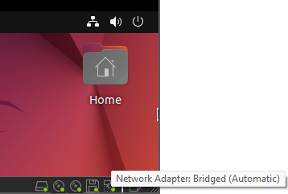
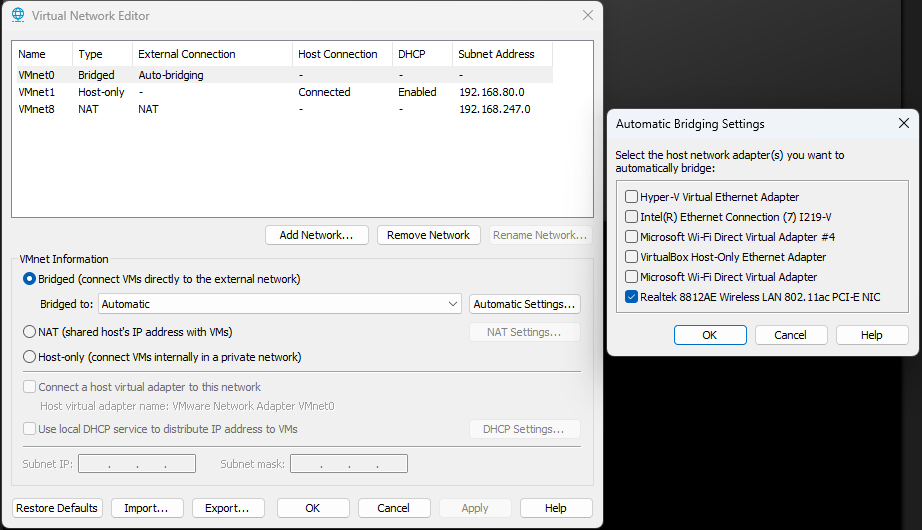

# Using the Turtlebot4

## Robot Assignments
When lab is over, you must power off the turtlebot and return it to the storage cabinet. Be mindful that this robot is shared with the other section. Regardless of how much you completed, record your progress. For robot assignments, partial credit may be given for partially working solutions on robot.

## 0. Get your assigned Turtlebot4
1. Check the lab group sign-up spreadsheet to get your robot ID for you and your partner.
2. This ID will correspond to your robot's IP address, the domain id, and discovery server id of the robot. This ID number is printed on the robot.

## 1. Turn on Turtlebot4
1. Place the Turtlebot4 on the charging station.
1. When the robot gets power, the light ring will turn on (white).
1. Wait 1-2 minutes for it to boot. It will chime when it is ready.
    - If the light ring turns a different color, it could be low battery, failed to connect wifi, or some other issue. Refer here: [Create3 Buttons and Light Ring Docs](https://iroboteducation.github.io/create3_docs/hw/face/)
    - If it repeatedly undocks from the docking station, press the dock button (1 dot) on top of the Turtlebot. It will attempt to autonomously dock. You must wait for it to finish. It might help to hold the docking station in place. The robot might get distracted by other docking stations. The undock button (2 dots) will undock the robot.

## 2. Connect to the Turtlebot4 via the ME597_TB4 network
1. First, connect your pc to ME597_TB4. The password is `turtlebot4`. If you are using a Virtual Machine, follow the VM network instructions at the bottom of the page.
1. The robot will automatically connect to ME597_TB4 on startup. 
1. (optional) Try to ping your Turtlebot4: `ping 192.168.1.1XX` (XX is your robot ID number)
    - It should say something like `64 bytes from 192.168.1.1XX: icmp_seq=1 ttl=64 time=33.3 ms`
    - If it says `destination host unreachable`, your PC cannot reach the robot via wifi.
    - Be patient. The Turtlebot4 must be fully booted. If it has not connected after a couple minutes, try restarting the Turtlebot4 and moving it closer to the router.

# ROS2 configuration
Recall from your lab 2 reading of [Turtlebot4 Networking](https://turtlebot.github.io/turtlebot4-user-manual/setup/networking.html), that connecting multiple devices in ROS2 has two primary configurations: Simple Discovery and Discovery Server. Below are instructions for both configurations - you will only need one. Your TAs will specify which configuration is being used.  

## 3A. Communicate with Turtlebot4 via ROS2: Simple Discovery
1. If you have configured your PC for Discovery Server in the past, go in your `~/.bashrc` and either remove or comment-out `source /etc/turtlebot4_discovery/setup.bash`. It is only needed for Discovery Server.

2. Change your ROS_DOMAIN_ID to match your Robot ID number with `export ROS_DOMAIN_ID=XX`, either in your terminal or in your `~/.bashrc` (if you want it to persist).

3. Make sure ROS_LOCALHOST_ONLY=0 (Only when communicating with the Turtlebot4!)

4. To test, do `ros2 topic list` in your PC. Turtlebot4 robot topics should be available.

    Is ros2 topic list not getting the robot topics?
    - Restart the ros2 daemon: `ros2 daemon stop; ros2 daemon start`
    - Do `ros2 topic list` twice.
    - Check again your connection to the Turtlebot4 using previous steps.
    - Check your PC configuration with `printenv | grep -i ros`
    - Make sure ROS_LOCALHOST_ONLY=0 (Only when communicating with the Turtlebot4!)
    - Power cycle the robot
    - Refer to debugging steps below

## 3B. Communicate with Turtlebot4 via ROS2: Discovery server
1. Do `User PC Setup` here: [Setup Discovery Server](https://turtlebot.github.io/turtlebot4-user-manual/setup/discovery_server.html#user-pc) (XX is your robot ID number)
```
ROS_DOMAIN_ID: XX
Discovery Server ID: XX
Discovery Server IP: 192.168.1.1XX
Discovery Server Port:
done (d)
```
2. To test, do `ros2 topic list` in your PC. Turtlebot4 robot topics should be available.

    Is ros2 topic list not getting the robot topics?
    - Restart the ros2 daemon: `ros2 daemon stop; ros2 daemon start`
    - Do `ros2 topic list` twice.
    - Check again your connection to the Turtlebot4 using previous steps.
    - Check your PC configuration with `printenv | grep -i ros`
    - Make sure ROS_LOCALHOST_ONLY=0 (Only when communicating with the Turtlebot4!)
    - Power cycle the robot
    - Refer to debugging steps below

3. When you are done using the physical robot, you must deactivate the discovery server settings for ROS2 to work with the simulator. See the instructions below to switch configurations.

## Switching between Simulator, Robot (Discovery Server), and Robot (Simple Discovery)
Your environment needs three different configurations for using the simulator and for connecting to the physical robot (in the two network configurations). To change between these, you need to modify your `~/.bashrc`. Below are snippets of what your `~/.bashrc` should look like:

### 1. To use Simulator:
```
source /opt/ros/humble/setup.bash
export ROS_LOCALHOST_ONLY=1       # Disables communication with other devices on the network
export ROS_DOMAIN_ID=XX           # Your student domain id here

### Comment out this line if you have it:
# source /etc/turtlebot4_discovery/setup.bash
```

### 2. To connect to Robot (Simple Discovery):
```
source /opt/ros/humble/setup.bash
export ROS_LOCALHOST_ONLY=0       # Enables communication with other devices on the network
export ROS_DOMAIN_ID=XX           # Your robot domain id here

### Comment out this line if you have it:
# source /etc/turtlebot4_discovery/setup.bash
```

### 3. To connect to Robot (Discovery Server):
```
source /opt/ros/humble/setup.bash
export ROS_LOCALHOST_ONLY=0       # Enables communication with other devices on the network
source /etc/turtlebot4_discovery/setup.bash  # Applies configuration specified in step 3B.1 
```


Remember to open a new terminal each time you switch. You may have to do `ros2 daemon stop; ros2 daemon start`

## Debugging the Turtlebot4 via ssh
As a last resort: If you have verified connection to wifi, pinged your robot, double checked your configuration, power cycled the robot, and you suspect an issue with the robot, you may use the following to debug:
1. SSH into the robot: `ssh ubuntu@192.168.1.1XX`. The password is `turtlebot4`

    ```
    DO NOT create or modify any files in the Turtlebot4.
    DO NOT upgrade or re-install any Turtlebot4 packages. 
    ```` 

    Remember, for assignments, you will use ROS2 on your PC and communicate via ROS2 topics and services with the turtlebot4.
1. Check topics and nodes with `ros2 topic list` `ros2 node list`
1. Do `turtlebot4-setup` 
    - DO NOT apply any new settings - if you think the configuration is wrong, consult a TA.
    - You may check the status of the turtlebot4 upstart job and restart it if necessary
    - You may view the current settings


## VM Network Instructions
Getting internet connection on a VM should be handled automatically by the VM, however, for ROS communication to work between your VM and another device, the VM Network Adapter must be in "Bridged" mode. In Bridged mode, the VM’s network adapter is connected directly to the physical network, as if it were a separate physical machine. The VM gets its own IP address on the local network, similar to other devices (like your physical computer, printers, etc.). 

For context, the default mode is probably NAT (Network Address Translation). In NAT mode, the VM is "hidden" behind the host machine’s IP address. The VM shares the host machine’s network connection and IP address, but it is assigned a private IP address within a virtual network managed by the hypervisor (e.g., VirtualBox, VMware). This causes issues with ROS communications because the VM is not directly accessible from the outside network.

To change this, do the following:
1. Shut down your VM safely, if it is running.
2. Click "Edit virtual machine settings" --> Network Adapter --> Bridged: Connected directly to the physical network --> OK 

3. Start VM and check if your VM has access to the network (ping google.com or open a browser). University wifi (eduroam and PAL3.0) likely won't work. Use the ME597_TB4 network.

4. You can follow these same steps to change back to NAT settings.

If this did not work, follow these steps from [this tutorial](https://onlinecomputertips.com/support-categories/pc-troubleshooting/vmware-workstation-bridged-connection-fix/):
1. Shut down your VM safely
1. Click "Edit" --> Virtual Network Editor...
1. Click "Change Settings"--> Yes to allow admin privileges
1. Change VMnet0 to Bridged, then click "Automatic Settings..." and de-select all of the adapters except your wifi adapter. (If you are not sure which one, you can go to your PC's wifi settings and click hardware properties)



5. Last, re-do steps 2 and 3 of the original instructions above ("Edit virtual machine settings" ...)